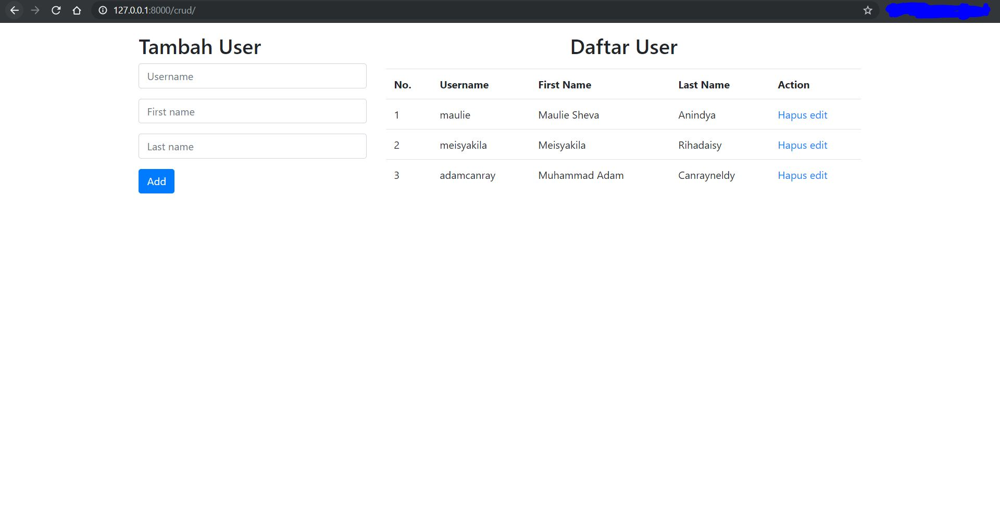
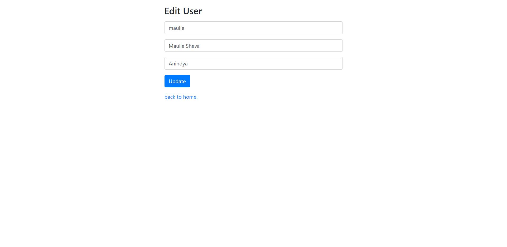

## Membuat website CRUD dengan Django dan MySQL
Python Version: **3.7.0** </br>
Django Version: **2.2.7** </br>

### Prerequisite:
* Install Python: [install python](https://www.python.org/downloads/)
* Install vitualenv: [install virtualenv](https://virtualenv.pypa.io/en/latest/installation/)
* Install Django: ```pip install django```
* Install MySQL: [install MySQL](https://dev.mysql.com/doc/mysql-installation-excerpt/5.5/en/) or [install XAMPP](https://www.apachefriends.org/download.html)


### Structure Files:
* **Env/** </br>
folder **Env** ini harus ada sebagai virtualenv. saya tidak meng-upload nya pada repo ini karena size yang lumayan hingga 109 MB(tergantung packages apa saja yang sudah terinstall). saya bisa membuat virtualenv dengan command berikut: ```python -m venv Env``` -- artinya kita ingin membuat sebuah virtualenv dengan nama folder-nya Env. pastikan virtual Env berada pada main folder(bisa ikuti langkah pada **0_catatan/1_membuat_project_django.txt**).
* **0_catatan/**
  * 0_project_target_time.txt -- adalah file yang berisi target saya dalam menyelesaikan project ini.
  * 1_membuat_project_django.txt -- file ini adalah langkah awal untuk membuat project django.
  * 2_setting_database.txt -- file ini berisi langkah setting database pada django.
  * 3_membuat_model_dan_migrasi.txt -- file ini berisi langkah saya dalam membuat **models** dan melakukan **migrate**.
  * 4_setting_urls_views.txt -- file ini berisi langkah saya dalam membuat **URL** dan membuat **Views**.
  * 5_membuat_templates.txt -- file ini berisi langkah saya dalam membuat templates dari App **crud**.
* **crudwithdjango/**
  * crud/ </br>
    * migrations/ -- adalah folder yang ada ketika saya melakukan **makemigration** untuk model User lalu melakukan **migrate**.
    * templates/ -- folder ini berisi file-file HTML yang digunakan **Views** sebagai Template-nya(tampilan HTML).
    * admin.py -- file ini berfungsi untuk mendaftarkan Model kita pada **Halaman Admin**.
    * apps.py -- file ini untuk menginisialisasikan apps kita agar dikenali oleh Django dan di-install pada **settings.py** pada folder project.
    * models.py -- file ini akan berisi model-model yang kita buat.
    * test.py -- file ini untuk usability testing pada django(mengetes apakah sebuah method itu me-return hasil yang **seharusnya** atau **tidak**).
    * urls.py -- file ini akan berisi path-path url yang bisa diakses oleh **user**.
    * views.py -- file ini akan berisi view-view yang ingin kita buat sebagai jembatan antara model dengan template(Interface User).
  * crudwithdjango/ </br>
    adalah folder project yang saya buat. untuk penjelasan detail mengenai fungsi dari file-file di dalam folder ini kamu bisa kunjungi repo ini [canrayLearnDjango](https:/github.com/adamcanray/canrayLearnDjango)
  * db.sqlite3 -- adalah file **database sqlite3** yang otomatis sudah terbuatketika kit amembuat project di django.
  * manage.py -- adalah file kunci yang untuk menjalankan testing, runserver dan semua yang kontrol pada project ada di file ini. contoh penggunaan: ```python manage.py runserver```
  
### Demo Aplication:

Index page


Edit page

